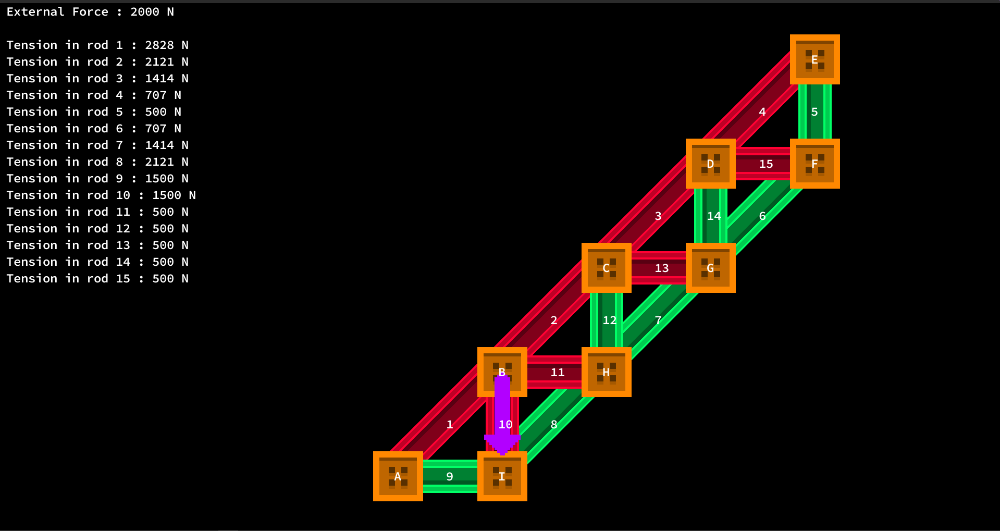

# TrussAnalyser

## A program which helps you analyse the distribution of forces given a Truss

### Step 1: Programming the truss

You can use a simple language to write the truss and put it in a `*.truss` file, the truss is defined by the points and the beams connecting it, the languages goes as follows
```
# defining the points for the given truss
A (7,8)
B (9,6)
C (5,4)

# joining the points with beams
A-B
B-C
C-A

# Now we put the reactions in at the pin and roller joints
RY1 A (0,1)
RX1 A (1,0)
RY2 B (0,1)

# Now for an external force which represents all the forces which behave as loads
~ F1 A (0,1)
~ F2 B (1/sqrt(2),1/sqrt(2))
```

You can see if your truss is rendered right by the following command
```bash
$ python3 main.py -p name.truss
```

### Step 2: Analysing the truss
You can use the following command to see the forces in every beam of the truss
```bash
$ python3 main.py -v main.truss
```

executing without the `-v` will show you the truss, and rods which are compressed and tense, usually, `green` is tense and `red` is compressed
<br><br>


